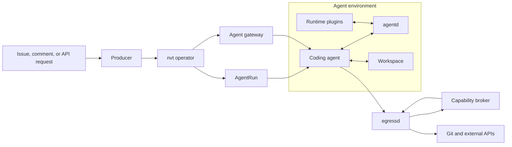
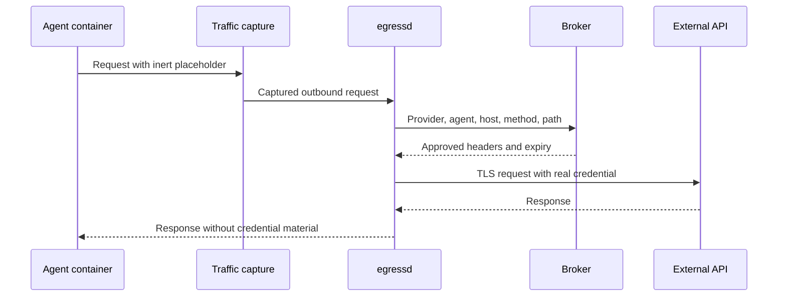
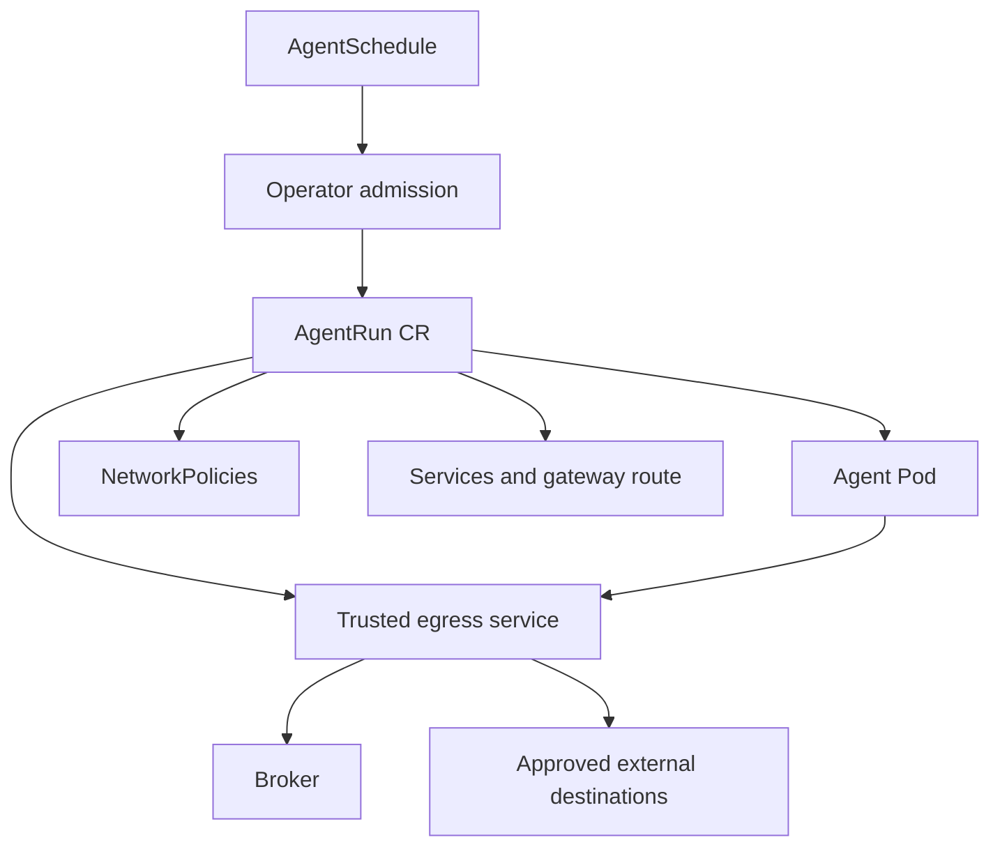

# nvt-agent

`nvt-agent` runs coding agents in isolated, reproducible environments. It works
locally with Docker Compose and in Kubernetes through an operator.

Each agent gets a workspace, a terminal coding CLI, optional code-server access,
runtime plugins, and its own Docker daemon. Codex and Claude Code are supported,
but the runtime contract is CLI-agnostic.

## How It Fits Together



The components have deliberately narrow jobs:

| Component | Responsibility |
| --- | --- |
| Runtime | Starts the coding CLI, workspace services, and plugins |
| `agentd` | Queues prompts, interacts with the terminal session, and records events |
| Operator | Creates and reconciles agent workloads in Kubernetes |
| Broker | Owns credentials, policy, refresh, and audit |
| `egressd` | Applies broker-approved credentials at the network edge |
| Gateway | Lists running agents and routes browser sessions |
| Producers | Turn external work, such as GitHub comments, into agent runs |

## Mediated Credentials

In mediated mode, the agent receives placeholders rather than real provider
credentials. Network traffic crosses a trusted egress boundary where the broker
authorizes the request and `egressd` injects the credential.



The broker is the only long-lived credential owner. It refreshes OAuth tokens,
supports scoped GitHub App and token providers, records audit events, and can
revoke grants while a run is active.

Mediation is optional. Direct mode remains available for local development and
tools that have not been moved behind broker-backed providers. Kubernetes can
add NetworkPolicy enforcement and a hardened `RuntimeClass`, including Kata
Containers.

## Local Quick Start

Requirements: Docker with Compose, Make, and a browser.

```sh
make runtime-build broker-build egressd-build captured-build
make infra-up

make agent-init NAME=demo
make agent-up NAME=demo
```

Open:

```text
http://demo.agent.localhost:4090
```

Common commands:

```sh
make agent-ps
make agent-logs NAME=demo
make agent-shell NAME=demo
make agent-doctor NAME=demo
make agent-down NAME=demo
make agent-rm NAME=demo FORCE=1
```

Create a Claude Code agent instead of the default Codex agent:

```sh
make agent-init NAME=demo-claude TYPE=claude
```

Generated agent definitions live under `.agents/<name>/`. Start with
[Local development agent](docs/local-development-agent.md) when configuring
repositories, broker grants, mediated credentials, or custom plugins.

## Kubernetes

The Helm chart installs the operator, broker, CRDs, and optional gateway. A
producer or another trusted client submits work to an `AgentSchedule`; the
operator creates an `AgentRun` and reconciles its Pods, Services, policy, status,
and cleanup.



The local Compose backend is intended for development. Kubernetes is the
production lifecycle and isolation model.

## Extensibility

Runtime plugins are executables with small configuration contracts. They can
check out repositories, expose tools, react to events, publish lifecycle
signals, or integrate with external systems. Exported tools run inside the
untrusted agent container, so secret-bearing operations should use broker-backed
providers.

Operator extensions are a separate concern: they influence scheduling,
placement, provisioning, routing, and policy rather than behavior inside an
agent session.

See [Runtime plugins](runtime/plugins/README.md) and the contracts under
[`protocol/`](protocol/).

## Documentation

- [Documentation map](docs/README.md)
- [Local development agent](docs/local-development-agent.md)
- [Codex authentication](docs/codex-auth.md)
- [Claude authentication](docs/claude-auth.md)
- [Transparent egress architecture](docs/transparent-egress-architecture.md)
- [Local GitHub producer](docs/local-kind-github-producer.md)
- [Helm charts and versioning](charts/README.md)
- [`agentd` protocol](protocol/agentd.md)
- [Broker protocol](protocol/broker.md)
- Full mediated producer canary verified.

## Project Status

The repository includes the local Compose runtime, Kubernetes operator,
capability broker, mediated egress, agent gateway, GitHub comment producer, and
Codex/Claude OAuth providers. Security-sensitive features remain opt-in so they
can be introduced per workload and provider.

Repository contribution and test guidance is in [AGENTS.md](AGENTS.md).

## Acknowledgements

Thanks to [agentdp](https://github.com/martinothamar/agentdp) for the inspiration.
