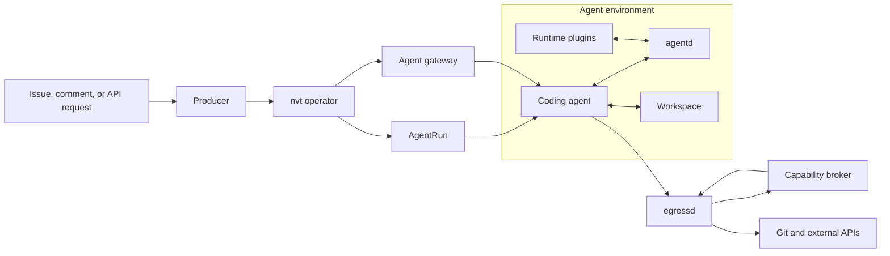
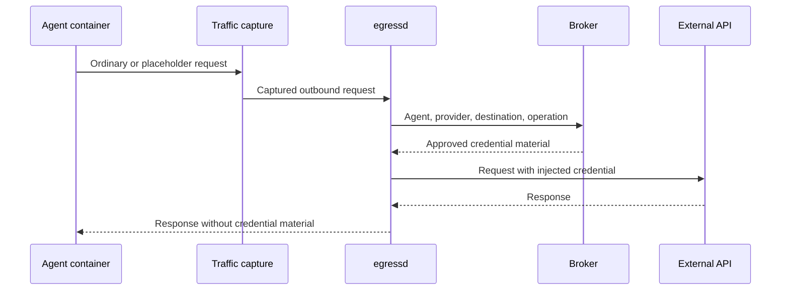

# nvt-agent


`nvt-agent` runs coding agents in isolated, reproducible environments. It uses
Docker Compose for local development and a Kubernetes operator for production.

Each agent receives a workspace, a terminal coding CLI, optional code-server
access, runtime plugins, and its own Docker daemon. Codex and Claude Code are
supported, while the runtime contract remains CLI-agnostic.

## Architecture


```mermaid
flowchart LR
    T[Issue, comment, or API request] --> P[Producer]
    P --> O[nvt operator]
    O --> R[AgentRun]

    subgraph Agent environment
        A[Coding agent]
        D[agentd]
        W[Workspace]
        X[Runtime plugins]
        A <--> D
        A <--> W
        X <--> D
    end

    R --> A
    O --> G[Agent gateway]
    G --> A
    A --> E[egressd]
    E --> B[Capability broker]
    E --> U[Git and external APIs]
    B --> E
```

| Component | Responsibility |
| --- | --- |
| Runtime | Starts the coding CLI, workspace services, and plugins |
| `agentd` | Queues prompts, interacts with the terminal session, and records events |
| Operator | Reconciles agent workloads in Kubernetes |
| Broker | Owns credentials, policy, refresh, and audit |
| `egressd` | Applies approved credentials at the network boundary |
| Gateway | Lists agents and routes browser sessions |
| Producers | Turn external work into agent runs |

## Mediated credentials

Mediated mode keeps real provider credentials outside the agent. File-based
tools receive inert placeholders; other requests can leave the agent without a
credential. Traffic passes through a trusted egress boundary, where `egressd`
asks the broker what may be injected for the selected provider and destination.


```mermaid
sequenceDiagram
    participant Agent as Agent container
    participant Capture as Traffic capture
    participant Egress as egressd
    participant Broker as Broker
    participant API as External API

    Agent->>Capture: Ordinary or placeholder request
    Capture->>Egress: Captured outbound request
    Egress->>Broker: Agent, provider, destination, operation
    Broker-->>Egress: Approved credential material
    Egress->>API: Request with injected credential
    API-->>Egress: Response
    Egress-->>Agent: Response without credential material
```

Direct mode remains available for local development and integrations that are
not mediated. Kubernetes deployments can enforce capture with NetworkPolicy
and use a hardened `RuntimeClass`, including Kata Containers.

## Run locally

Requirements: Docker with Compose, Make, and a browser.

```sh
cp nvt.local.example.yaml nvt.local.yaml
make local-images local-init local-up
```

Open `http://nvt.agent.localhost:4090`.

The local manifest defines profiles, repositories, workstations, workflows,
accounts, broker providers, and producers. Secret inputs stay in the ignored
`.nvt-local/secrets/` directory. Codex and Claude OAuth accounts are enrolled
through **Manage credentials** in the gateway.

See [Local development](docs/local-development-agent.md) for lifecycle and
configuration details.

## Deploy to Kubernetes

The Helm chart installs the CRDs, operator, broker, and optional gateway,
credential portal, and GitHub comments producer. A trusted producer submits
work to an `AgentSchedule`; the operator creates an `AgentRun` and reconciles
its Pods, storage, Services, routes, policy, status, and cleanup.

See the [Helm chart guide](charts/nvt/README.md) for installation and production
configuration.

## Extend nvt

Runtime plugins are executables with small configuration contracts. They can
check out repositories, expose tools, react to events, publish lifecycle
signals, or integrate with external systems. Secret-bearing operations should
use broker-backed providers because exported tools run in the untrusted agent
container.

See [Runtime plugins](runtime/plugins/README.md) and the contracts under
[`protocol/`](protocol/).

## Documentation

- [Documentation map](docs/README.md)
- [Transparent mediated egress](docs/transparent-egress-architecture.md)
- [AgentRun API](operator/docs/agentrun.md)
- [AgentSchedule API](operator/docs/agentschedule.md)
- [Broker protocol](protocol/broker.md)
- [Contributing](CONTRIBUTING.md)

## License

Licensed under the [Apache License 2.0](LICENSE).
