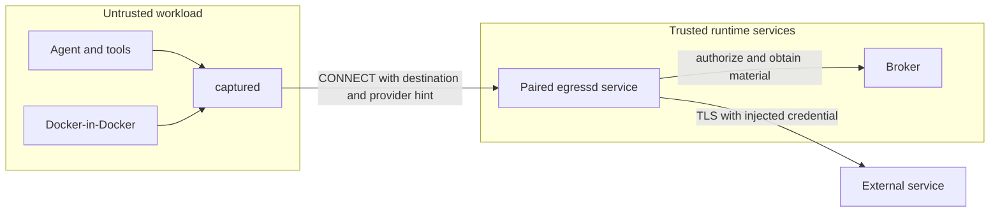

# Transparent Mediated Egress

## Purpose

Transparent mediated egress routes an AgentRun's permitted internet-bound TCP
traffic through its paired `egressd` endpoint while keeping provider
credentials outside the untrusted workload.

The enforceable invariant is:

> Every permitted internet-bound TCP connection traverses the paired
> `egressd` service; attempted bypasses are dropped by the CNI.

This is narrower than "every packet traverses egressd." Loopback, cluster DNS,
and explicitly approved control-plane traffic are excluded. UDP is not
currently proxied.

## Trust Boundaries


```mermaid
flowchart LR
    subgraph U[Untrusted workload]
        A[Agent and tools]
        D[Docker-in-Docker]
        C[captured]
        A --> C
        D --> C
    end

    subgraph T[Trusted runtime services]
        E[Paired egressd service]
        B[Broker]
    end

    C -->|CONNECT with destination and provider hint| E
    E -->|authorize and obtain material| B
    E -->|TLS with injected credential| X[External service]
```

- **Agent workload:** untrusted. It may contain source code, inert placeholders,
  public CA certificates, and route metadata, but not provider credentials or
  the interception CA private key.
- **`captured`:** credential-less transport plumbing for workload traffic. It is
  not a security boundary.
- **`egressd`:** trusted per-run egress service. It terminates only configured
  TLS destinations and injects only broker-approved material. Its deployment
  placement is owned by the operator or local renderer, not this contract.
- **Broker:** trusted credential, refresh, grant, quota, revocation, and audit
  authority.
- **CNI:** the bypass-prevention boundary. It must enforce NetworkPolicy.

## Modes

`AgentRun` keeps the feature optional:

```yaml
spec:
  egress: mediated
  egressEnforcement: true
  egressTransport: transparent
  # Optional active CONNECT bound; default 256, allowed range 1-4096.
  egressMaxConcurrentTunnels: 512
```

| Setting | Behavior |
| --- | --- |
| `egress: direct` | Existing direct networking and direct credential compatibility |
| `egress: mediated` | Broker-backed materialization and egressd routing |
| `egressEnforcement: true` | CNI-enforced guarantee that workload egress traverses the paired egress service |
| `egressTransport: redirect` | Tool-specific base URL or redirect configuration |
| `egressTransport: forward-proxy` | `HTTP(S)_PROXY` for proxy-aware tools |
| `egressTransport: transparent` | iptables capture for ordinary TCP clients |

The pre-1.0 `spec.egressForwardProxy` compatibility behavior has been removed.
Migrate `egressForwardProxy: true` to `egressTransport: forward-proxy`; use
`egressTransport: redirect` for the old false/default behavior. A temporary API
tombstone retains the field name only to reject either legacy value; it never
selects behavior.

Runtime configuration likewise uses `egress.transport` as its sole selector.
The legacy `egress.forward-proxy` key is rejected even when set to `false`;
`forward-proxy-url` remains the endpoint setting for proxy-based transports.

## Traffic Capture

The transparent renderer installs IPv4 and IPv6 NAT rules in the workload
network namespace after Docker-in-Docker has initialized its chains. The setup
step receives only `NET_ADMIN`.

Conceptually:

```text
OUTPUT:
  allow loopback and capture-process traffic
  allow Pod-side traffic leaving through docker0 or any br-* bridge
  redirect remaining TCP to captured:15001

PREROUTING:
  allow destinations in the managed Docker pool (172.30.0.0/15)
  redirect TCP arriving from docker0 or any br-* bridge to captured:15001
```

Before installing these rules, net-init sets
`net.bridge.bridge-nf-call-iptables` and
`net.bridge.bridge-nf-call-ip6tables` to `0` when the corresponding sysctl
exists and verifies the readback. A missing sysctl means that bridge family is
not hooked into inet netfilter; a failed write or nonzero readback fails
net-init. This uses the kernel bridge/routing boundary directly and has no
ebtables, nftables bridge-family, or `physdev` dependency.

Frames switched between ports on an isolated Docker bridge stay in the L2
bridge path, including packets that retain a separately routed nested-workload
destination. They therefore do not enter IPv4/IPv6 PREROUTING. Traffic
addressed to the bridge host/gateway enters the normal routing stack and still
traverses inet PREROUTING, where the `docker0`/`br-*` redirects send it to
captured. A peer that originates or forwards external traffic likewise emits
a host-directed frame and re-enters capture.

The coordinated DinD image configures Docker with the explicit managed pool
`172.30.0.0/15`: `172.30.0.0/24` is the default bridge and dynamic networks
come from `172.31.0.0/16`. Net-init returns only that bounded pool before the
redirect, so bridges created after startup remain covered without a kernel FIB
expression. Traffic outside the pool, including private, metadata, and
control-plane destinations, remains captured and subject to the existing
egress policy when routed through the bridge host. Local bridge transit is
kept at L2 without a nested workload CIDR allowlist. Custom Docker subnets
outside this managed pool are unsupported
unless a future validated configuration explicitly extends the contract; they
must not be silently exempted.

Deployments must reserve `172.30.0.0/15` so it does not overlap Pod, Service,
control-plane, broker, metadata, excluded, or denied destination ranges. The
operator cannot safely infer all cluster routes from inside an AgentRun
network namespace; such an overlap is a deployment configuration error and
must be rejected during network configuration review before transparent Docker
networking is enabled.

Forward-proxy and transparent transports default to 256 active CONNECT
tunnels. A profile may set `egressMaxConcurrentTunnels` from 1 through 4096.
When all active slots are occupied, egressd queues at most the configured
number of requests for five seconds; a released slot admits a waiting request,
while sustained overload and cancellation fail explicitly without unbounded
goroutines or sockets. Capacity logs report only non-secret active, queued,
admitted, timed-out, and rejected counts.

The `captured` process recovers the original destination with
`SO_ORIGINAL_DST`. It inspects a bounded TLS ClientHello or HTTP preface to
recover the hostname when available, then opens a CONNECT tunnel to the paired
egress endpoint. It does not terminate TLS, inspect application payloads, or
hold credentials.

The opt-in native-VM host-bundle capture boundary reuses this same bounded
original-destination and Host/SNI inspector. Instead of dialing CONNECT
directly, it passes the canonical destination only to the current
authenticated native-egress `FlowOpener`; absent or withdrawn transport closes
the connection with no fallback. The provider still owns the redirect into
the literal loopback listener and the external network confinement that makes
that redirect non-bypassable.

Proxy-aware clients may use `captured`'s explicit listener on port 15002. This
path preserves an explicit provider selector when more than one provider uses
the same hostname. Workload-wide generic HTTP proxy variables remain unset in
transparent mode so normal HTTP follows the transparent TCP path; a plugin with
an explicit provider receives only the scoped HTTPS proxy needed to carry that
selector.

## Provider Selection

Hostname alone is not a credential selector. Multiple GitHub Apps, Codex
accounts, or Claude accounts may share one upstream host.

- Runtime configuration and the generic `plugins[].egress.provider` contract
  select a broker provider explicitly. Lifecycle processes and exported tools
  receive the same provider-scoped proxy environment at their launch boundary.
- The selector is carried as non-secret routing metadata to egressd.
- Missing or ambiguous selection fails closed.
- `captured` never guesses a provider from host order or available grants.

Unmatched destinations may use an opaque blind tunnel only when destination
policy permits it. Credential injection always requires a configured hostname
and provider route.

## Credential Injection

For an injection route, egressd:

1. Matches the requested host and explicit capability to a configured route.
2. Asks the broker for injectable material under its egress identity.
3. Enforces grant, host, method, path, quota, and revocation decisions.
4. Terminates TLS using a per-run CA constrained to approved names.
5. Removes inert placeholders and injects the real header.
6. Re-originates TLS to a pinned upstream host and records a sanitized report.

The agent identity cannot call the injection endpoint. The egress identity is
paired to exactly one agent and cannot request capabilities not granted to
that agent. No credential values are logged.

The broker-to-egressd connection uses TLS because this is the internal leg that
carries real material. The interception CA private key is stored in a per-run
Secret and made available only to the trusted egress service, never the
untrusted workload.

## Bypass Prevention

iptables provides routing, not the final security boundary. A privileged
workload could alter local rules. Kubernetes enforcement therefore adds two
level-reconciled NetworkPolicies:

### Untrusted workload

Allows only:

- cluster DNS;
- the run's paired egress endpoint and declared listener ports;
- narrowly configured control-plane endpoints when required.

There is no internet CIDR rule. If local capture is removed, direct internet
traffic is denied by the CNI.

### Egress service

Allows:

- ingress from its paired workload;
- broker and DNS access;
- approved external TCP ports;
- explicitly labelled test fixtures when insecure upstreams are enabled for
  hermetic tests.

NetworkPolicy is additive. AgentRuns must use a namespace where untrusted users
cannot add policies that grant direct egress. The configured CNI must actually
enforce policy; the default kind networking does not provide that proof, so the
enforcement smoke uses Calico.

## Destination Safety

Blind tunnelling is constrained to prevent egressd becoming an SSRF gateway:

- loopback, private, link-local, metadata, multicast, reserved, benchmark, and
  deployment-supplied cluster CIDRs are denied;
- hostname resolution and dialing use one validated result to resist DNS
  rebinding;
- only configured external TCP ports are allowed, normally 80 and 443;
- injection routes pin hostname, port, TLS SNI, and outbound Host;
- only configured injection hosts are TLS-terminated.

Encrypted ClientHello can hide a hostname. When inspection cannot identify a
name, only an explicitly permitted opaque IP tunnel is possible; credentials
are never injected into that path.

## Local Compose

Compose uses the same `captured` process, redirect rules, provider selection,
and egressd behavior. The agent, DinD, and captured services share DinD's
network namespace; egressd uses a separate private Compose network.

This proves functionality and provider-secret non-possession. It is not equal
to Kubernetes enforcement: privileged local containers can modify iptables,
and Compose has no independent CNI NetworkPolicy fence. Do not use the Compose
capture test as evidence that bypass is impossible.

## Verification

The automated suites cover:

- proxy-aware, proxy-unaware, raw TCP, and DinD traffic;
- removal of local capture rules without restoration of direct egress;
- cross-run egressd denial;
- private and metadata destination denial;
- injection with provider-secret non-possession;
- blind tunnels for unmatched permitted hosts;
- explicit provider selection for shared hosts;
- broker denial, quota, revocation, and refresh failure.

See [Kubernetes smoke tests](../tests/operator/kind/README.md), the
[transparent transport contract](../protocol/transparent-egress.md), and the
[injection protocol](../protocol/injection.md).

## Limitations

- Transparent capture currently covers TCP, not arbitrary UDP or QUIC.
- DNS goes directly to the configured cluster resolver.
- Local Compose is a development backend, not an equivalent CNI security
  boundary.
- Direct and non-enforced mediated modes remain available for compatibility;
  they must not be described as enforced transparent egress.

## Independently managed VMs

Kubernetes NetworkPolicy is the bypass-prevention boundary for Pod/Kata runs;
it does not confine an independently managed VM. A root-capable VM agent can
replace guest-local capture and firewall state. The provider-neutral
[native VM egress contract](../protocol/native-egress.md) therefore requires a
trusted execution driver/provider to enforce default-deny NIC/network policy
outside the guest, plus an exact-binding authenticated outbound tunnel into the
run's separate trusted egress path. Both gates are required. The contract,
conformance proof, identity authority, guest flow client, cluster relay, and an
optional strict process-owned exact-binding adapter into per-run egressd
exist. Guest capture is a separate credential-less process: transparent flows
carry no provider hint, while its explicit CONNECT listener consumes the
existing per-flow provider selector before forwarding raw bytes. It reuses
bounded Host/SNI/original-destination inspection and never falls back to direct
networking, but it is not a root-adversary boundary. Dynamic operator target
publication/readiness, provider-owned redirect installation, and provider
confinement are not wired yet, so production VM mediation remains incomplete.
