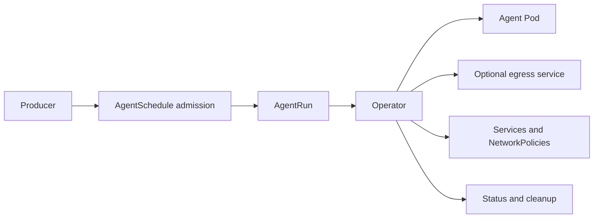

# nvt Kubernetes Operator

The operator reconciles nvt custom resources into isolated agent workloads.
It is the production lifecycle backend; Docker Compose remains the local
development backend.

## Resources

- `AgentRun` describes one disposable agent workload.
- `AgentSchedule` is a generic admission pool with suspend, parallelism, and
  duplicate-work controls.

An AgentRun is independent of its producer. It may be submitted manually,
through AgentSchedule admission, by the GitHub comments producer, or by another
trusted scheduler.



## Build And Test

From the repository root:

```sh
make operator-build
make operator-helm-test
```

Run the Kubernetes smoke suite in kind:

```sh
make operator-kind-setup
make operator-kind-smoke
make operator-kind-delete
```

Enforced egress tests require the NetworkPolicy-capable cluster target:

```sh
make operator-kind-cluster-enforced
```

See [Kubernetes smoke tests](../tests/operator/kind/README.md) for individual
cases and prerequisites.

## Install

The root Helm chart installs the CRDs, operator, broker, and an optional agent
gateway:

```sh
helm upgrade --install nvt ./charts/nvt \
  --namespace nvt \
  --create-namespace
```

Provider credentials are not rendered into chart values. Create a broker env
Secret separately and reference it with `broker.envSecretName`. See the
[Helm chart documentation](../charts/nvt/README.md) for TLS, persistence,
gateway OIDC, and egress configuration.

## Controller Responsibilities

The controller:

- validates direct and mediated grant combinations;
- renders agent configuration and workspace storage;
- reconciles broker identities and grants;
- creates agent, egress, Service, and NetworkPolicy resources;
- records workload conditions and terminal status;
- applies active deadlines and terminal resource retention;
- repairs owned enforcement resources when they drift or disappear.

The operator does not implement runtime plugins or coding-tool behavior.
Runtime behavior stays inside the agent image and plugin contracts.

## Security Boundaries

- Profiled schedule admission authenticates projected ServiceAccount tokens
  through TokenReview and exact-matches `spec.allowedProducers`; legacy
  full-AgentRun admission remains cluster-internal during migration.
- Provider credentials belong to the broker and trusted egress path, not the
  Agent Pod in mediated mode.
- Transparent enforcement requires a CNI that enforces NetworkPolicy.
- `RuntimeClass` remains workload-selectable, including Kata Containers.
- The gateway must use OIDC authorization before external exposure.

See [Transparent mediated egress](../docs/transparent-egress-architecture.md)
for the complete trust and network model.

## Reference

- [AgentRun API](docs/agentrun.md)
- [AgentSchedule API](docs/agentschedule.md)
- [Kind Codex auth helper](docs/kind-codex-auth.md)
- [Helm chart](../charts/nvt/README.md)
- [Gateway](../gateway/README.md)
- [CRD manifests](config/crd/bases/)
